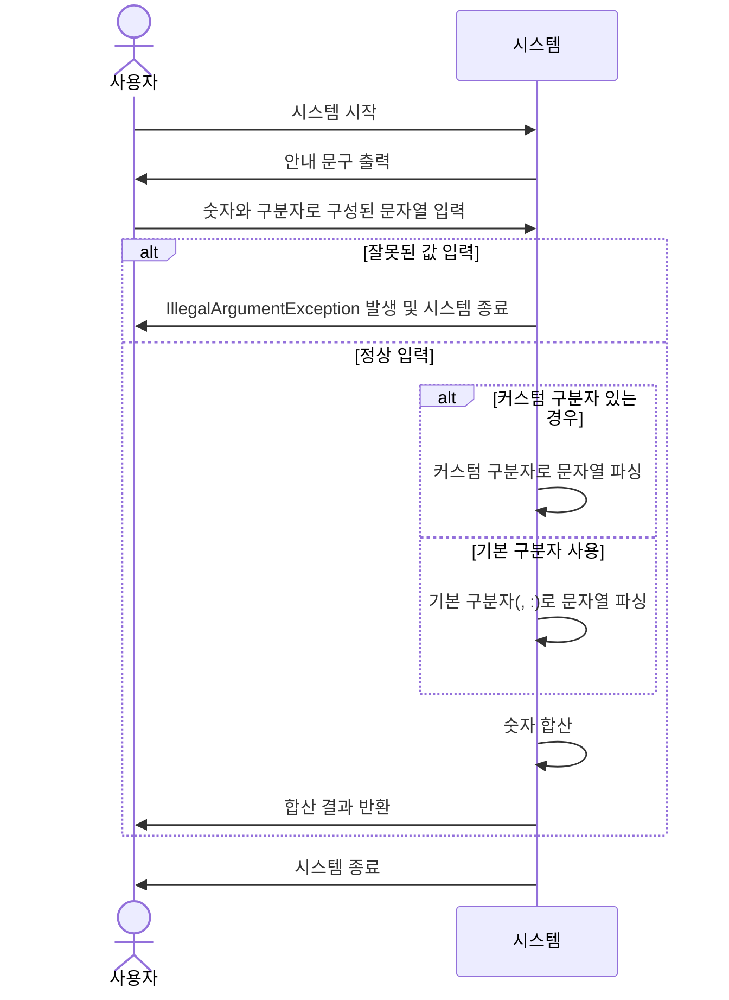

# 1주차_RS_문자열 뎃셈 계산기
## 기능 요구 사항
목표: 입력한 문자열에서 숫자를 추출하여 더하는 계산기를 구현한다.
* "쉼표(,) or 콜론(:)"을 `구분자`로 가지는 `문자열`을 `전달`하는 경우 `구분자를 기준으로 분리한` 각 `숫자의 합`을 `반환`한다.
    * 예: "" => 0, "1,2" => 3, "1,2,3" => 6, "1,2:3" => 6
* `커스텀 구분자` 지정 가능(상기 기본 구분자 외)
    * 문자열 앞 "//" "\\n" 사이에 위치하는 문자
    * 예: "//;\\n1;2;3" => ; , 6 반환
* `사용자 입력 오류`(잘못된 입력)
    * `IllegalArgumentException` 발생, 애플리케이션 종료

### 입출력 요구 사항

#### 입력
* 구분자와 양수로 구성된 문자열

#### 출력
* 덧셈 결과
    ```ada
    결과 : 6
    ```
#### 실행 결과 예시
```ada
덧셈할 문자열을 입력해 주세요.
1,2:3
결과 : 6
```

## 1. 유스케이스 분석
- 유스케이스명: 입력된 문자열을 파싱해 더한다
- 액터 : 사용자
- 주요 성공 시나리오
  1. 사용자가 `시스템을 시작`하여 `시스템`이 `안내 문구`를 `출력`한다.
  2. 사용자가 "숫자와 `구분자`로 구성"된 `문자열`을 입력한다.
  3. 시스템은 `문자열을 파싱`하여 `숫자를 합`해 `사용자에게 반환`하고 `종료`한다.
- 확장
  - 2-a. 사용자가 `잘못된 값을 입력`하면 `IllegalArgumentException`와 함께 `종료`한다.
  - 2-b. 사용자는 문자열 앞에 "//;\\"와 같이 `커스텀 구분자`를 지정하여 문자열을 입력할 수 있다.
- 시퀀스 다이어그램


## 2. 도메인 분석
- 역할
  - InputHandler : 문자열 입력기
    - 사용자의 입력을 
  - Parser : 파서
  - Caculator : 계산기
  - CustomDelimiter : 커스텀 구분자
  - Delimiter : 구분자
  - InputValidator
- 책임 