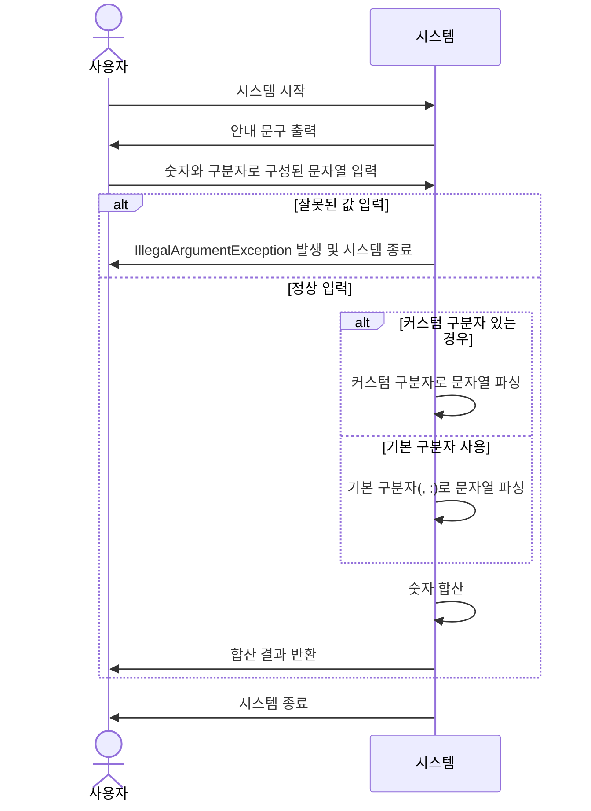

# 미션 요구사항 분석

> 1주차 문서 모음
> | **[](1주차-문자열-덧셈-계산기.md)** | **[](1주차-미션-요약.md)** | **[](1주차-주간-학습-정리.md)** |

## 기능 요구 사항

목표: 입력한 문자열에서 숫자를 추출하여 더하는 계산기를 구현한다.

* "쉼표(,) or 콜론(:)"을 `구분자`로 가지는 `문자열`을 `전달`하는 경우 `구분자를 기준으로 분리한` 각 `숫자의 합`을 `반환`한다.
    * 예: "" => 0, "1,2" => 3, "1,2,3" => 6, "1,2:3" => 6
* `커스텀 구분자` 지정 가능(상기 기본 구분자 외)
    * 문자열 앞 "//" "\\n" 사이에 위치하는 문자
    * 예: "//;\\n1;2;3" => ; , 6 반환
* `사용자 입력 오류`(잘못된 입력)
    * `IllegalArgumentException` 발생, 애플리케이션 종료

### 입출력 요구 사항

#### 입력

* 구분자와 양수로 구성된 문자열

#### 출력

* 덧셈 결과
    ```
    결과 : 6
    ```

#### 실행 결과 예시

```
덧셈할 문자열을 입력해 주세요.
1,2:3
결과 : 6
```

## 1. 유스케이스 분석

- 유스케이스명: 입력된 문자열을 파싱해 더한다
- 액터 : 사용자
- 주요 성공 시나리오
    1. 사용자가 `시스템을 시작`하여 `시스템`이 `안내 문구`를 `출력`한다.
    2. 사용자가 "숫자와 `구분자`로 구성"된 `문자열`을 입력한다.
    3. 시스템은 `문자열을 파싱`하여 `숫자를 합`해 `사용자에게 반환`하고 `종료`한다.
- 확장
    - 2-a. 사용자가 `잘못된 값을 입력`하면 `IllegalArgumentException`와 함께 `종료`한다.
    - 2-b. 사용자는 문자열 앞에 "//;\\"와 같이 `커스텀 구분자`를 지정하여 문자열을 입력할 수 있다.
- 시퀀스 다이어그램(임시)



## 2. 도메인 분석

#### 역할

    - InputHandler : 문자열 입력기
    - Parser : 파서
    - Caculator : 계산기
    - CustomDelimiter : 커스텀 구분자
    - Delimiter : 구분자
    - InputValidator : 입력 값 검증기

#### 책임

    - 안내 문구를 출력한다.
    - 문자열을 입력 받는다.
      - 입력 라이브러리가 별도로 지정됨
      - 공식 문서가 없어 동작 방식을 확인 해야함.
    - 커스텀 구분자가 있는지 확인한다.
      - 있다면 구분자를 추출해 구분자로 추가한다.
      - 구분자 지정을 위한 부분을 삭제한다.
    - 입력 문자열을 검증한다.
      - 첫 문자가 "/", "숫자", ""(공백) 중 하나다.
        - 첫 문자는 어떻게 확인하나?
        - 입력 단계에서 검증할 사항은 이것 하나 인가?
        - 문자열 가장 앞에 다른 것이 오면?
    - 문자열에 구분자와 숫자만 있나?
    - 구분자 기준으로 문자열을 파싱한다.
      - 문자열에 구분자와 숫자만 있는지 확신할 수 있나?=>추가
      - 파싱된 숫자는 유효한가?
    - 파싱되어 반환된 숫자들을 더한다.
    - 결과를 출력한다.
    - 구분자를 관리한다.
    - 잘못된 입력이면 예외를 발생 시킨다.

#### 역할에 책임 할당, 각각의 책임에 의문인 점

    - InputHandler
      - 안내 문구를 출력한다.
      - 문자열을 입력 받는다.
        - 입력 라이브러리가 별도로 지정됨
        - 공식 문서가 없어 동작 방식을 확인 해야함.
    - InputValidator
      - 잘못된 입력이면 예외를 발생 시킨다.
      - 입력 문자열을 검증한다.
        - 첫 문자가 "/", "숫자", ""(공백) 중 하나다.
          - 첫 문자는 어떻게 확인하나?
          - 입력 단계에서 검증할 사항은 이것 하나 인가?
          - 문자열 가장 앞에 다른 것이 오면?
    -CustomDelimiter
      - 커스텀 구분자가 있는지 확인한다.
        - 있다면 구분자를 추출한다.
        - 구분자 지정을 위한 부분을 삭제한다.
      - 커스텀 구분자가 
    - Delimiter
      - 구분자를 관리한다.
    - Parser
      - 구분자 기준으로 문자열을 파싱한다.
        - 문자열에 구분자와 숫자만 있는지 확신할 수 있나?=>추가
        - 파싱된 숫자는 유효한가?
      - 잘못된 입력이면 예외를 발생 시킨다.
    - Calculator
      - 안내 문구를 출력한다.
      - 문자열을 입력 받는다.
        - 입력 라이브러리가 별도로 지정됨
        - 공식 문서가 없어 동작 방식을 확인 해야함.
      - 파싱되어 반환된 숫자들을 더한다.
      - 결과를 출력한다.