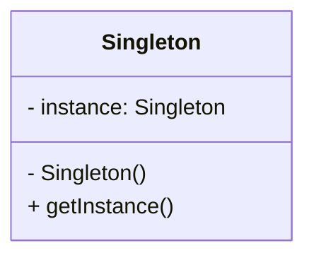

# 싱글턴과 함께 보는 우테코의 Console

우테코는 외부 라이브러리 사용을 금지했습니다.
추가로 입력과 랜덤 연산은 자체 라이브러리를 통해 실시하도록 통제했죠.
그 이유는 무엇일까요?

## 빌드 그레이들 파일 통해 보는 의존성 {id="1"}

> - `build.gradle` 파일은 변경할 수 없으며, 제공된 라이브러리 이외의 외부 라이브러리는 사용하지 않는다.
> - 프로그램 종료 시 `System.exit()`를 호출하지 않는다.
> - [우테코 프리코스 프로그래밍 요구사항 중 발췌]

{style="warning"}

### 우테코 미션 속 라이브러리

아래는 우테코 프리코스의 미션의 빌드 그레이들 파일입니다.

```gradle
plugins {
    id 'java'
}

group = 'camp.nextstep.edu'
version = '1.0-SNAPSHOT'

java {
    toolchain {
        languageVersion = JavaLanguageVersion.of(21)
    }
}

repositories {
    mavenCentral()
    maven { url 'https://jitpack.io' }
}

dependencies {
    implementation 'com.github.woowacourse-projects:
    mission-utils:1.2.0'
}

test {
    useJUnitPlatform()
}

```

{collapsible="true" default-state="collapsed"}

우리는 바로 이 `dependencies` 내부에 해당 라이브러리 하나만 의존성이 등록되었음을 볼 수 있습니다.
`implementation 'com.github.woowacourse-projects:mission-utils:1.2.0'`

그리고 test 영역에 `useJUnitPlatform()` 하나만 등록되어 있습니다.

하지만, 분명 ApplicationTest에는 AssertJ Junit.Jupiter를 사용합니다.
프로젝트의 그래이들 탭을 눌러보거나 다음 명령을 실행해보면 확실하게 확인 할 수 있습니다.

```Bash
# 프로젝트 의존성 조회
./gradlew dependencies


> Task :dependencies

------------------------------------------------------------
Root project 'java-racingcar'
------------------------------------------------------------

annotationProcessor - Annotation processors and their
 dependencies for source set 'main'.
No dependencies

compileClasspath - Compile classpath for source set 'main'.
\--- com.github.woowacourse-projects:mission-utils:1.2.0
     +--- org.assertj:assertj-core:3.26.3
     |    \--- net.bytebuddy:byte-buddy:1.14.18
     \--- org.junit.jupiter:junit-jupiter:5.11.0
          +--- org.junit:junit-bom:5.11.0
          |    +--- org.junit.jupiter:junit-jupiter:5.11.0 (c)
          |    +--- org.junit.jupiter:junit-jupiter-api:5.11.0 (c)
          |    +--- org.junit.jupiter:junit-jupiter-params:5.11.0 (c)
          |    \--- org.junit.platform:junit-platform-
          commons:1.11.0 (c)
          +--- org.junit.jupiter:junit-jupiter-api:5.11.0
          |    +--- org.junit:junit-bom:5.11.0 (*)
          |    +--- org.opentest4j:opentest4j:1.3.0
          |    +--- org.junit.platform:junit-platform-commons:1.11.0
          |    |    +--- org.junit:junit-bom:5.11.0 (*)
          |    |    \--- org.apiguardian:apiguardian-api:1.1.2
          |    \--- org.apiguardian:apiguardian-api:1.1.2
          \--- org.junit.jupiter:junit-jupiter-params:5.11.0
               +--- org.junit:junit-bom:5.11.0 (*)
               +--- org.junit.jupiter:junit-jupiter-api:5.11.0 (*)
               \--- org.apiguardian:apiguardian-api:1.1.2

compileOnly - Compile-only dependencies for the 'main' feature. (n)
No dependencies

default - Configuration for default artifacts. (n)
No dependencies

implementation - Implementation dependencies 
for the 'main' feature. (n)
\--- com.github.woowacourse-projects:mission-utils:1.2.0 (n)

mainSourceElements - List of source directories contained in the Main 
SourceSet. (n)
No dependencies

runtimeClasspath - Runtime classpath of source set 'main'.
\--- com.github.woowacourse-projects:mission-utils:1.2.0
     +--- org.mockito:mockito-core:5.14.1
     |    +--- net.bytebuddy:byte-buddy:1.15.3
     |    +--- net.bytebuddy:byte-buddy-agent:1.15.3
     |    \--- org.objenesis:objenesis:3.3
     +--- org.assertj:assertj-core:3.26.3
     |    \--- net.bytebuddy:byte-buddy:1.14.18 -> 1.15.3
     \--- org.junit.jupiter:junit-jupiter:5.11.0
          +--- org.junit:junit-bom:5.11.0
          |    +--- org.junit.jupiter:junit-jupiter:5.11.0 (c)
          |    +--- org.junit.jupiter:junit-jupiter-api:5.11.0 (c)
          |    +--- org.junit.jupiter:junit-jupiter-engine:5.11.0 (c)
          |    +--- org.junit.jupiter:junit-jupiter-params:5.11.0 (c)
          |    +--- org.junit.platform:junit-platform-commons:1.11.0 (
          c)
          |    \--- org.junit.platform:junit-platform-engine:1.11.0 (c
          )
          +--- org.junit.jupiter:junit-jupiter-api:5.11.0
          |    +--- org.junit:junit-bom:5.11.0 (*)
          |    +--- org.opentest4j:opentest4j:1.3.0
          |    \--- org.junit.platform:junit-platform-commons:1.11.0
          |         \--- org.junit:junit-bom:5.11.0 (*)
          +--- org.junit.jupiter:junit-jupiter-params:5.11.0
          |    +--- org.junit:junit-bom:5.11.0 (*)
          |    \--- org.junit.jupiter:junit-jupiter-api:5.11.0 (*)
          \--- org.junit.jupiter:junit-jupiter-engine:5.11.0
               +--- org.junit:junit-bom:5.11.0 (*)
               +--- org.junit.platform:junit-platform-engine:1.11.0
               |    +--- org.junit:junit-bom:5.11.0 (*)
               |    +--- org.opentest4j:opentest4j:1.3.0
               |    \--- org.junit.platform:junit-platform-commons:1.1
               1.0 (*)
               \--- org.junit.jupiter:junit-jupiter-api:5.11.0 (*)

runtimeElements - Runtime elements for the 'main' feature. (n)
No dependencies

runtimeOnly - Runtime-only dependencies for the 'main' feature. (n)
No dependencies

testAnnotationProcessor - Annotation processors and their dependencies
 for source set 'test'.
No dependencies

testCompileClasspath - Compile classpath for source set 'test'.
\--- com.github.woowacourse-projects:mission-utils:1.2.0
     +--- org.assertj:assertj-core:3.26.3
     |    \--- net.bytebuddy:byte-buddy:1.14.18
     \--- org.junit.jupiter:junit-jupiter:5.11.0
          +--- org.junit:junit-bom:5.11.0
          |    +--- org.junit.jupiter:junit-jupiter:5.11.0 (c)
          |    +--- org.junit.jupiter:junit-jupiter-api:5.11.0 (c)
          |    +--- org.junit.jupiter:junit-jupiter-params:5.11.0 (c)
          |    \--- org.junit.platform:junit-platform-commons:1.11.0 (
          c)
          +--- org.junit.jupiter:junit-jupiter-api:5.11.0
          |    +--- org.junit:junit-bom:5.11.0 (*)
          |    +--- org.opentest4j:opentest4j:1.3.0
          |    +--- org.junit.platform:junit-platform-commons:1.11.0
          |    |    +--- org.junit:junit-bom:5.11.0 (*)
          |    |    \--- org.apiguardian:apiguardian-api:1.1.2
          |    \--- org.apiguardian:apiguardian-api:1.1.2
          \--- org.junit.jupiter:junit-jupiter-params:5.11.0
               +--- org.junit:junit-bom:5.11.0 (*)
               +--- org.junit.jupiter:junit-jupiter-api:5.11.0 (*)
               \--- org.apiguardian:apiguardian-api:1.1.2

testCompileOnly - Compile only dependencies for source set 'test'. (n)
No dependencies

testImplementation - Implementation only dependencies for source set '
test'. (n)
No dependencies

testRuntimeClasspath - Runtime classpath of source set 'test'.
\--- com.github.woowacourse-projects:mission-utils:1.2.0
     +--- org.mockito:mockito-core:5.14.1
     |    +--- net.bytebuddy:byte-buddy:1.15.3
     |    +--- net.bytebuddy:byte-buddy-agent:1.15.3
     |    \--- org.objenesis:objenesis:3.3
     +--- org.assertj:assertj-core:3.26.3
     |    \--- net.bytebuddy:byte-buddy:1.14.18 -> 1.15.3
     \--- org.junit.jupiter:junit-jupiter:5.11.0
          +--- org.junit:junit-bom:5.11.0
          |    +--- org.junit.jupiter:junit-jupiter:5.11.0 (c)
          |    +--- org.junit.jupiter:junit-jupiter-api:5.11.0 (c)
          |    +--- org.junit.jupiter:junit-jupiter-engine:5.11.0 (c)
          |    +--- org.junit.jupiter:junit-jupiter-params:5.11.0 (c)
          |    +--- org.junit.platform:junit-platform-commons:1.11.0 (
          c)
          |    \--- org.junit.platform:junit-platform-engine:1.11.0 (c
          )
          +--- org.junit.jupiter:junit-jupiter-api:5.11.0
          |    +--- org.junit:junit-bom:5.11.0 (*)
          |    +--- org.opentest4j:opentest4j:1.3.0
          |    \--- org.junit.platform:junit-platform-commons:1.11.0
          |         \--- org.junit:junit-bom:5.11.0 (*)
          +--- org.junit.jupiter:junit-jupiter-params:5.11.0
          |    +--- org.junit:junit-bom:5.11.0 (*)
          |    \--- org.junit.jupiter:junit-jupiter-api:5.11.0 (*)
          \--- org.junit.jupiter:junit-jupiter-engine:5.11.0
               +--- org.junit:junit-bom:5.11.0 (*)
               +--- org.junit.platform:junit-platform-engine:1.11.0
               |    +--- org.junit:junit-bom:5.11.0 (*)
               |    +--- org.opentest4j:opentest4j:1.3.0
               |    \--- org.junit.platform:junit-platform-commons:1.1
               1.0 (*)
               \--- org.junit.jupiter:junit-jupiter-api:5.11.0 (*)

testRuntimeOnly - Runtime only dependencies for source set 'test'. (n)
No dependencies

(c) - A dependency constraint, not a dependency. The dependency affect
ed by the constraint occurs elsewhere in the tree.
(*) - Indicates repeated occurrences of a transitive dependency subtre
e. Gradle expands transitive dependency subtrees only once per 
project;
 repeat occurrences only display the root of the subtree, followed by 
 this annotation.

(n) - A dependency or dependency configuration that cannot be 
resolved.

A web-based, searchable dependency report is available by adding the 
--scan option.

```

{collapsible="true" default-state="collapsed"}

왜 build.gradle 에 없는 외부 라이브러리가 사용되었을까요.

### transive depencies(전이 의존성)

특정 라이브러리를 의존성으로 추가하면, 그 라이브러리 가지고 있는 의존성이 함께 딸려 오게 됩니다.

gradle의 의존성을 보면 그 시작점에 공통으로 우테코의 mission-utils 에서 시작합니다.
해당 라이브러리가 자신의 의존성을 우리의 미션 프로젝트에 전이시킨 것으로 보입니다.

해당 의존성 전이를 통해 우리는 다음과 같은 외부 라이브러리를 사용할 수 있습니다.

1. mission-utils : 우테코가 제공한 라이브러리; 공개된 기능은 입력, 랜덤
2. Assertj-core  : 테스트에서 단언(assertion) 기능 제공
3. JUnit-jupiter : JUnit 5 API와 주요 애노테이션(@Test, @BeforeEach 등)
4. JUnit-platform-commons  : JUnit 공통 기능 제공, 플랫폼 공통 모듈
5. Mockito-core  : 테스트에서 목 객체(mock object) 생성을 위한 라이브러리

이제 AssertJ, JUnit5, Mockito 3개의 외부 라이브러리를 자유롭게 이용할 수 있는 것을 확인했습니다.
그렇다면 camp.nextstep.edu.missionutils 은 어떤 라이브러리일까요?

이번 편에서는 missionutils 라이브러리와 Console 클래스에 대해서만 알아보겠습니다.

## missionutils {id="2"}

위 라이브러리에서 현재 공개된 동작은 2 가지입니다.

1. 입력
2. 무작위 값 추출

다른 동작은 없을까요?

InteliJ 프로젝트 탭에서 `외부 라이브러리`를 열고 mission-utils을 찾아 봅시다.
해당 폴더를 열어보면 다음과 같이 나옵니다.

|  |
|--------------------------------------------------------------|

이중 우리는 두 가지의 힌트를 얻었습니다.

```Java
   // Random 값 추출
   camp.nextstep.edu.missionutils.Randoms.pickNumberInRange()
   // 사용자 입력
   camp.nextstep.edu.missionutils.Consol.readLine()
```

위 메서드는 어떻게 정의되었을까요?
그리고 우테코는 왜 입력과 랜덤 추출을 해당 메서드로 통제했을까요?

### Console 클래스

우선 사용자 입력을 살펴보겠습니다.

아래의 코드는 missionutils의 Console 클래스 입니다.

```Java
package camp.nextstep.edu.missionutils;

import java.util.Scanner;

public class Console {
    private static Scanner scanner;

    private Console() {
    }

    public static String readLine() {
        return getInstance().nextLine();
    }

    public static void close() {
        if (scanner != null) {
            scanner.close();
            scanner = null;
        }
    }

    private static Scanner getInstance() {
        if (scanner == null) {
            scanner = new Scanner(System.in);
        }
        return scanner;
    }
}
```

{collapsible="true" default-state="collapsed"}

우리는 `readLine()`을 호출해 입력을 받고 값을 저장합니다.
해당 메서드는 `getInstance().nextLine()`를 호출합니다.
먼저 `getInstance()`을 다시 보시겠습니다.

```Java
   private static Scanner getInstance() {
        if (scanner == null) {
            scanner = new Scanner(System.in);
        }
        return scanner;
    }
```

갑자기 `Console`의 static 필드 변수 `scanner`에 대해 null 체크를 진행합니다.
그 후 널이 아닌 경우만 인스턴스를 생성하고 `scanner`를 리턴 합니다.
전형적인 **싱글턴 패턴**입니다.
싱글턴을 통해 어플리케이션 전체에서 `Scanner` 클래스가 단 하나의 인스턴스만 있도록 합니다.

#### 결국 Scanner, 그런데 이제 싱글턴을 곁들인

우선 싱글턴은 무엇일까요?
> 싱글턴 패턴은 클래스 인스턴스를 하나만 만들고, 그 인스턴스로의 전역 접근을 제공합니다.
> 
> [ 헤드퍼스트 디자인 패턴 Ch 05 싱글턴 패턴 (p.211) ]


싱글턴은 `인스턴스가 단 하나임을 보장`하고 `전역 접근`을 제공한다고 합니다.



싱글턴의 클래스 다이어그램입니다.
클래스 다이어그램에서 이름 아래 영역은 필드, 그 아래 영역은 오퍼레이션(생성자와 메서드)을 나타냅니다.
접근 제어자는 각각 다음과 같이 표현합니다.

- public => "+"
- private => "-"
- package-private => ""(아무 표시 안함)
- protected => "#"

{columns="4"}

`Condole` 클래스 내부에 1개의 메서드와 생성자를 제외하고는 필드 변수까지 전부 `public static`입니다.
이것이 **`전역 접근`**을 위한 조치이겠죠?

인스턴스를 단 하나만 보장하기 위한 조건은 2가지입니다.
우선 생성자를 `private`으로 제한하고 `getInstance()`를 `public static`로 구현하면 됩니다.
해당 메서드는 위에서 살펴본 것과 같이 인스턴스가 할당되었는지 확인하고 null인 경우에만 생성자를 호출합니다.

우리의 `Console`은 일반적인 싱글턴과 다르게 `getInstance()`가 `public`이 아닌 `private`입니다.
그리고 `getInstance()`를 호출하는 메서드는 단 하나, `readLine()`입니다.
이는 우리가 `readLine()`을 통해 입력을 구현하게 강제하는 것이겠죠?

그렇다면 우테코는 Scanner 대신 **왜** 이런 방식으로 사용자 입력을 받도록 제한했을까요?

#### Console은 왜 Scanner에 싱글턴을 적용했나?

특정 클래스에 싱글턴을 적용하는 이유는 다양하지만 몇 가지만 추려보겠습니다.

1. 자원 관리(시스템, 공유)
2. 일관성 유지
3. 자원 관리
4. 객체 생성 비용 감소
5. 자원 해제 관리

위 이유들을 종합해서 생각해 봅시다.
입력이 여러 번 요구된다고 Scanner 클래스를 여러번 생성하면 그만큼 메모리와 스레드가 낭비되겠습니다.
일관성 유지는 입력에 대한 독점적 관리를 통해 입력 처리가 일관되고 안정적으로 수행될 수 있겠네요.
또 만약 지원자가 입력 스트림을 닫지 않으면 생성된 인스턴스가 해제되지 않고 잔존하여 자원을 낭비할 수 있겠네요.

채점 시스템이 어떻게 구현되었는지 모르겠지만, 우테코에서는 2000 여 명의 코드를 채점해야 하니 그런 경우가 계속 누적되면 상당히 치명적이겠습니다.

갑자기 채점 프로그램 구현 방식에 대한 궁금증이 생기네요.
알아내기 위해서라도 꼭 우테코에 들어가야겠습니다.

이쯤에서 이런 생각을 해볼 수 있습니다.

> 나는 1주 차 미션을 진행하며 Console 을 닫은 적이 없는데?!?!

{style="warning"}

사실 이 비밀은 테스트 코드에 숨겨져있습니다.

## 테스트 코드 작성법은 빠진 테스트 코드 이야기 {id="3"}

테스트 코드에 대해 언급하지만 테스트 방법에 대해서는 일절 얘기하지 않을 예정입니다.
Console 클래스를 보다보니 테스트 코드를 예기하지 않을 수 없더라고요.
사실상 우테코에서 라이브러리를 통제하는 이유와 가까운 것 같습니다.

혹시 1주 차에 입력과 출력에 대한 테스트 코드를 작성하신 분이 있으신가요?
대단하십니다.

사실 이 포스트를 작성하게 된 근본적인 이유이기도 합니다.
1주차 미션을 수행하며 기능 목록에 처음으로 올린 것이 입출력 구현이었습니다.
그리고 저는 지원서에 TDD를 공부하며 적용하겠다고 적었습니다.

입출력 테스트, 말만 들어도 쉬울 것 같지 않나요?

> 입출력은 스트림이라는 통로를 이용한다.

{style="tip"}

**입출력 스트림(I/O Stream)**은 프로그램과 외부 자원(파일, 콘솔, 네트워크 등) 간에 데이터를 주고받는 통로를 의미합니다.
**스트림(Stream)**은 연속적인 데이터 흐름을 의미합니다. 스트림을 통해 데이터가 한 방향으로 흐르며, 읽기와 쓰기를 처리하는 방식을 단순화합니다.
자바에서는 스트림을 통해 데이터가 순차적으로 전송됩니다.
데이터가 한 번에 모두 전송되는 것이 아니라, 바이트 단위로 전송됩니다.
이를 통해 메모리를 효율적으로 사용할 수 있죠.

이러한 방식으로 입출력이 처리되기 때문에 입출력은 직접 테스트하기 힘듭니다.
따라서 입출력에 대한 테스트는 입출력 스트림을 리다이렉트하거나 모의 객체(Mock Object)를 이용합니다.

다시 한번 테스트 코드나 리다이렉트와 Mock에 관하여 설명하지 않겠다는 말씀을 먼저 드릴게요.
다만 여러분도 아시는 코드를 보여드릴게요.
다음 코드는 1주차 미션의 `ApplicationTest.java`입니다.

```Java
package calculator;

import camp.nextstep.edu.missionutils.test.NsTest;
import org.junit.jupiter.api.Test;

import static camp.nextstep.edu.missionutils.test.Assertions
.assertSimpleTest;
import static org.assertj.core.api.Assertions.assertThat;
import static org.assertj.core.api.Assertions.assertThatThrownBy;

class ApplicationTest extends NsTest {
    @Test
    void 커스텀_구분자_사용() {
        assertSimpleTest(() -> {
            run("//;\\n1");
            assertThat(output()).contains("결과 : 1");
        });
    }

    @Test
    void 예외_테스트() {
        assertSimpleTest(() ->
            assertThatThrownBy(() -> runException("-1,2,3"))
                .isInstanceOf(IllegalArgumentException.class)
        );
    }

    @Override
    public void runMain() {
        Application.main(new String[]{});
    }
}
```

{collapsible="true" default-state="collapsed"}

해당 `ApplicationTest.java`는 missionutils의 `NsTest`를 extends, import 합니다.
`run()`, `runException()` 두 메서드가 정의되지 않고 사용됩니다.
`runMain()` 메서드는 `@Override` 어노테이션이 붙어있네요.
`NsTest`에 무엇인가 있는 것 같군요.

<p>
macOS는 <shortcut>⌘B</shortcut>, 윈도우는 <shortcut>Ctrl+B</shortcut> 를 눌러 선언 위치로 이동해봅시다.
</p>

```Java
package camp.nextstep.edu.missionutils.test;

import camp.nextstep.edu.missionutils.Console;
import org.junit.jupiter.api.AfterEach;
import org.junit.jupiter.api.BeforeEach;

import java.io.ByteArrayInputStream;
import java.io.ByteArrayOutputStream;
import java.io.OutputStream;
import java.io.PrintStream;
import java.util.NoSuchElementException;

public abstract class NsTest {
    private PrintStream standardOut;
    private OutputStream captor;

    @BeforeEach
    protected final void init() {
        standardOut = System.out;
        captor = new ByteArrayOutputStream();
        System.setOut(new PrintStream(captor));
    }

    @AfterEach
    protected final void printOutput() {
        System.setOut(standardOut);
        System.out.println(output());
    }

    protected final String output() {
        return captor.toString().trim();
    }

    protected final void run(final String... args) {
        try {
            command(args);
            runMain();
        } finally {
            Console.close();
        }
    }

    protected final void runException(final String... args) {
        try {
            run(args);
        } catch (final NoSuchElementException ignore) {
        }
    }

    private void command(final String... args) {
        final byte[] buf = String.join("\n", args).getBytes();
        System.setIn(new ByteArrayInputStream(buf));
    }

    protected abstract void runMain();
}
```

{collapsible="true" default-state="collapsed"}

`package camp.nextstep.edu.missionutils.test;`를 보니 우테코의 missionutils 라이브러리 내부에 있네요?
test 패키지 내부에 있는 것으로 보니 test 코드일까요?

코드를 살펴보니 테스트 메서드에 붙는 `@Test` 어노테이션이 없습니다.
테스트 클래스는 아닌 것 같군요.
`java.io`의 여러 클래스를 `import` 하네요.
입력과 출력 스트림 관련 처리도 있는 것 같습니다.
살펴보니 테스트를 위한 기능을 준비한 듯 합니다.
혹시 모르니 코드를 하나씩 언급하진 않겠습니다.

아까 `ApplicationTest.java`에서 run() 메서드를 호출했던 것을 기억하시나요?
해당 메서드의 코드를 살펴보면 try-finally를 통해 마지막에 `Console.close()`를 호출하네요.
무슨 일이 있더라도 메서드 호출이 끝나면 `Console.close()`을 통해 `Console`의 필드에 있는 `scanner` 인스턴스를 `null`로 바꾸는 것 같습니다.

결국 우테코에서는 이런 방식의 테스트 코드로 우리가 제출한 pr을 채점하는 것으로 보입니다.

## 마무리하며

여기까지 읽으신 분들은 우테코 프리코스 채점은 GitHub Action 등을 이용해 특정 테스트 코드를 실행하는 것으로 이뤄지는 것을 공감하실 겁니다.
채점을 위한 Application 을 통해 우테코의 자체 테스트 코드를 실행하는 것이 반복되겠죠.
하지만, `missionutils`에서 싱글턴으로 유지되는 객체는 무엇인가 어색합니다.

헤드퍼스트 디자인 패턴에는 싱글턴의 단점에 대한 언급이 있습니다.
우선 멀티스레드, 리플렉스, 직렬화, 역질렬화 문제가 있다고 합니다.
`synchronized`를 사용해 멀티스레드로 구현하면, 동기화로 인해 불필요한 오버헤드가 증가한다고 합니다.
따라서 멀티스레딩 문제를 위해 4가지를 제안합니다.

1) 속도가 중요하지 않으면 동기화를 하지 않는다.
2) 처음부터 만든다.(정적 초기화 부분에서 생성자를 통해 인스턴스를 생성하고 메서드로 단순히 리턴)
3) DCL을 적용한다. (두 번 null 체크하며 인스턴스 할당이 동기화되기 전 접근하는 것을 막음)
4) 해당 클래스를 enum으로 구현한다.

결론적으로 책에서는 enum을 사용하면 동기화, 클래스 로딩, 리플렉션, 직렬화, 역직렬화 등의 다양한 문제를 해결할 수 있다고 합니다.

여기서 이러한 의문이 남습니다.

1. 채점 방식은 멀티스레드가 아닌 것인가?
2. enum으로 싱글턴을 구현하지 않은 이유는 무엇인가?

### 채점은 멀티 스레드가 아닌가?

지원하기를 통해 미션을 제출하면 마지막 커밋에 대한 채점이 이루어집니다.
채점 대상자의 수는 대략 2000 여 명이죠. 신기하게도 채점은 늦어도 수 분 안에 종료됩니다.
1주차 미션의 ApplicationTest의 평균적인 실행 시간은 50ms 내외였습니다. (실행 환경 : Mac air m3)
인당 50ms 씩 2000명은? 고작 100초 입니다.
2분 조금 안되는 시간이죠.
만약 수차례 채점을 시도하여 4000번의 시도가 시스템 큐에서 대기한다고 해도, 고작 4분 입니다.
지원하기 페이지에서는 2분~5분 정도 걸릴 수 있다는 안내 문구가 있으니 비슷한 것 같습니다.

이러한 사실을 생각해 봤을 때, 처리 속도가 크게 상관 없어 멀티 스레드를 적용하지 않은 것 같네요.

### 왜 Enum을 사용하지 않았나?

자바 실무자들이 enum으로 싱글턴을 구현하지 않는 이유를 찾아봤습니다.

1. 기능 확장의 어렵다
    - enum은 본질적으로 상수를 표현하기 위한 구조이기 때문에, 일반 클래스처럼 자유롭게 상속하거나 확장하기가 어렵다고 합니다.
    - 싱글턴 객체는 보통 복잡한 초기화 과정이나 다양한 기능을 포함하지, enum은 그러한 기능을 제공하기에 한계가 있다도 해요.
2. 빈 관리 방식과 충돌한다.
    - Spring 같은 의존성 주입(DI) 프레임워크에서는 싱글턴 빈을 위해 주로 클래스 기반의 싱글턴 객체를 생성합니다.
    - 프레임워크 자체에서 싱글턴 빈 관리가 자체적으로 이루어지므로 enum을 사용할 필요가 없습니다.
    - 오히려 프레임워크와 enum 기반 싱글턴 패턴을 혼용하면 관리 측면에서 힘들어지죠.
3. 초기화 로직이 복잡하다.
    - enum은 클래스 로딩 시점에 인스턴스를 초기화하기 때문에 **지연 초기화(Lazy Initialization)**가 어렵습니다.
    - 이로 인해 초기화 과정이 복잡하거나, 여러 리소스 또는 외부 시스템과 연결되어야 할 경우 적합하지 않습니다.
    - 반면, 클래스 기반은 지연 초기화 방식을 선택적으로 적용할 수 있어 초기화가 필요한 시점에만 수행되도록 유연하게 관리할 수 있습니다.
4. 테스트 및 Mocking이 어렵다.
    - enum은 JVM이 단 하나의 인스턴스만 보장하도록 설계되어, 테스트에서 해당 인스턴스를 대체하거나 수정할 수 없습니다.
5. 일반적인 인스턴스 관리 규칙과 차이가 있다.
    - enum 싱글턴은 enum 자체의 특수한 직렬화 방식을 따르기 때문에, 표준 직렬화 방식과 호환되지 않습니다.
    - 다양한 라이브러리나 프레임워크와 통합할 때, enum 싱글턴이 예외적으로 동작할 가능성을 높입니다.


### 마무리를 마무리합시다!

입출력을 테스트하려는 시도로 시작해 Console과 NsTest를 거쳐 싱글턴까지 복습하는 기회가 되었네요.
더 하고 싶은 말이 많았습니다.
궁금증을 해결해가며 gradle의 `jitpack`와 라이브러리의 Random, Assertions 등이 무슨 역할을 하는지 살펴보다 보니 흥미로운 점들이 많아졌습니다.
여러 부분에서 많은 고민이 녹아있는 것으로 보였죠.

결론적으로 우테코 라이브러리의 `Console`은 입력을 위한 호출, 인스턴스 관리, 자원 해제 3가지를 보장하기 위해 제공하는 것 같습니다.
추가로 입출력 테스트를 위한 준비도 해당 라이브러리에 포함되어 있었습니다.

재미있었습니다.


